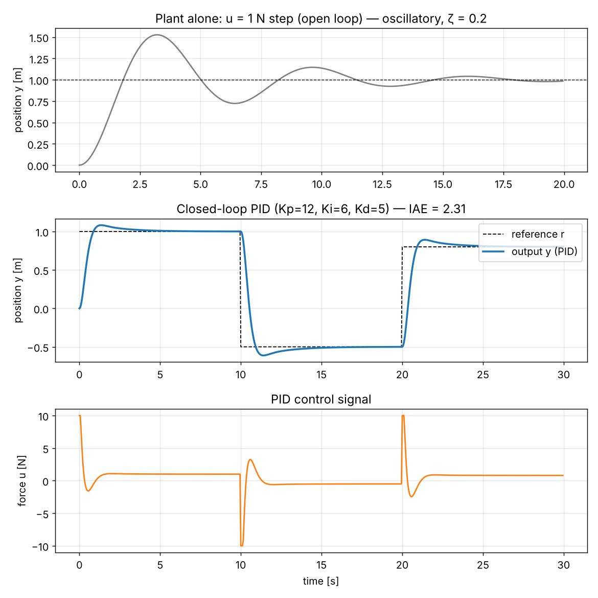
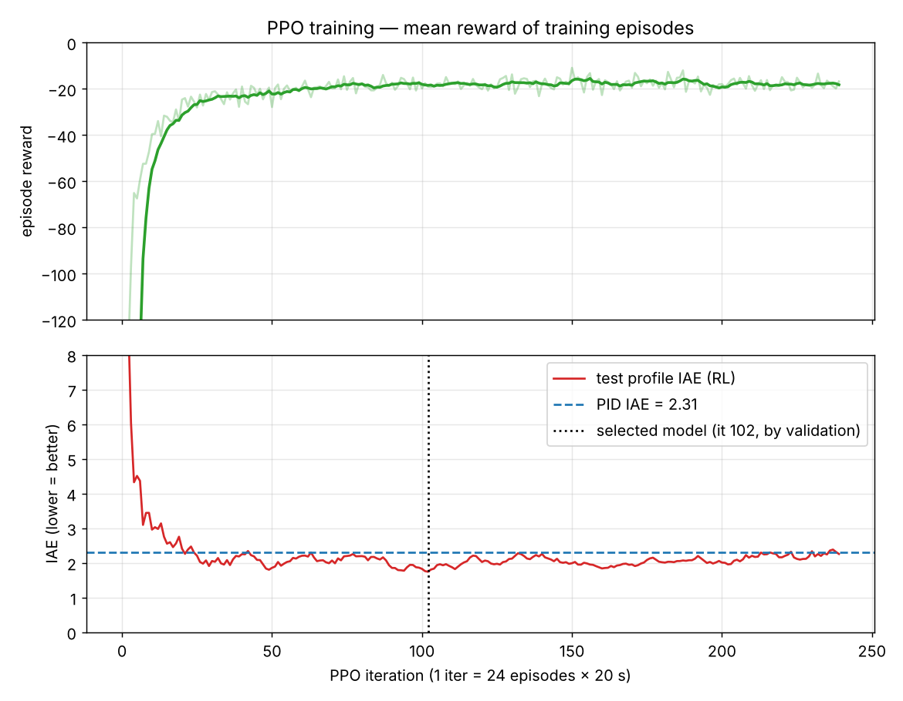
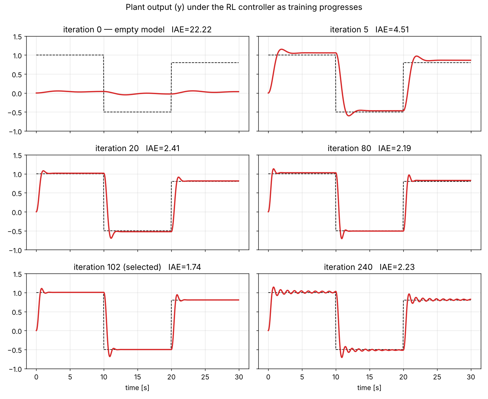
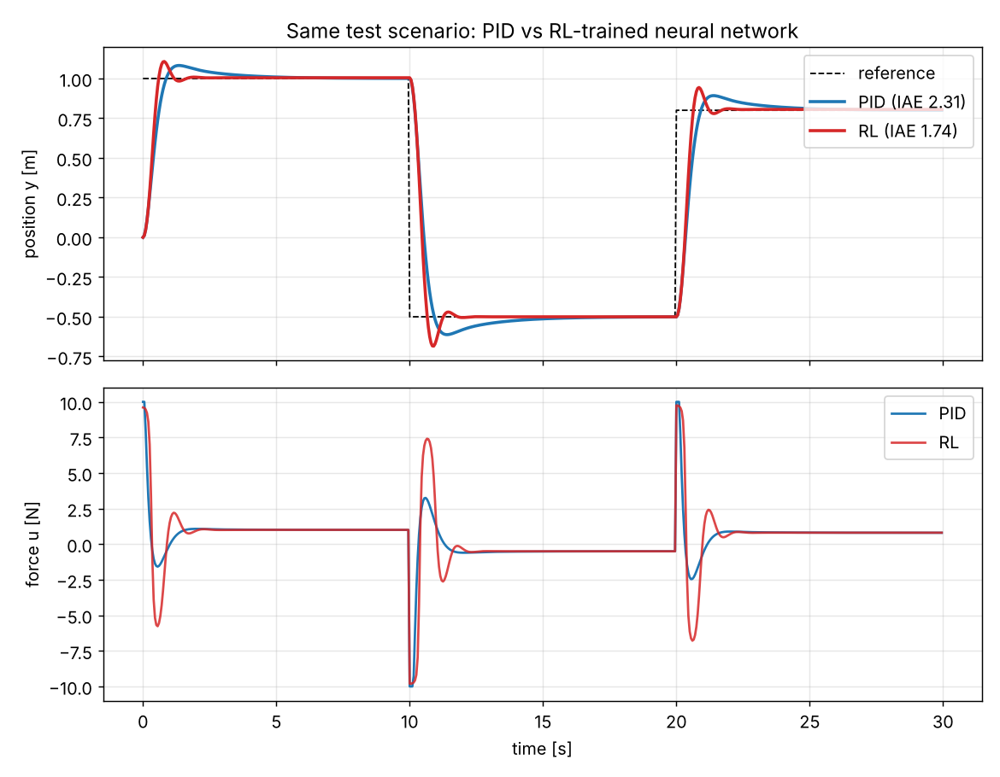
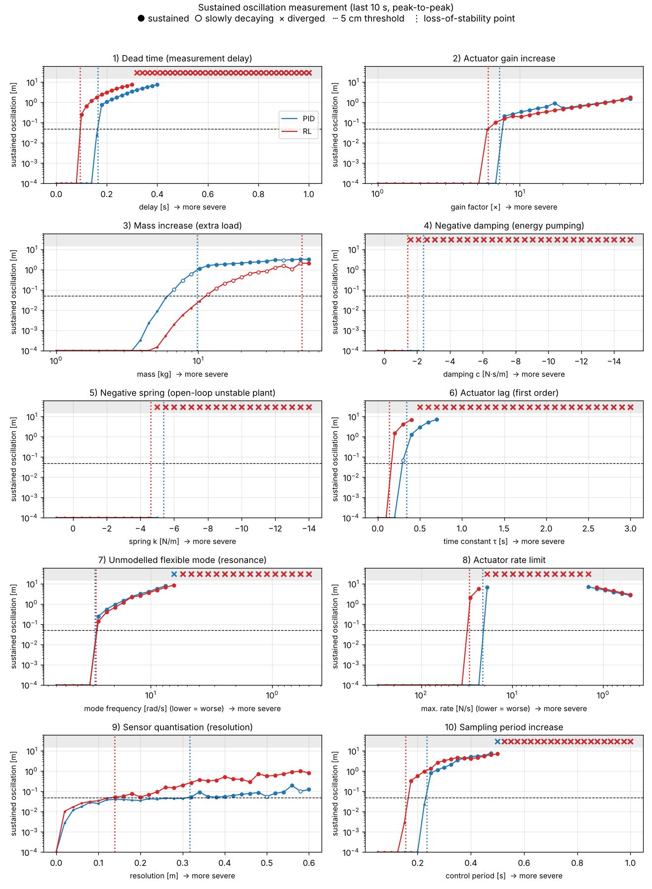
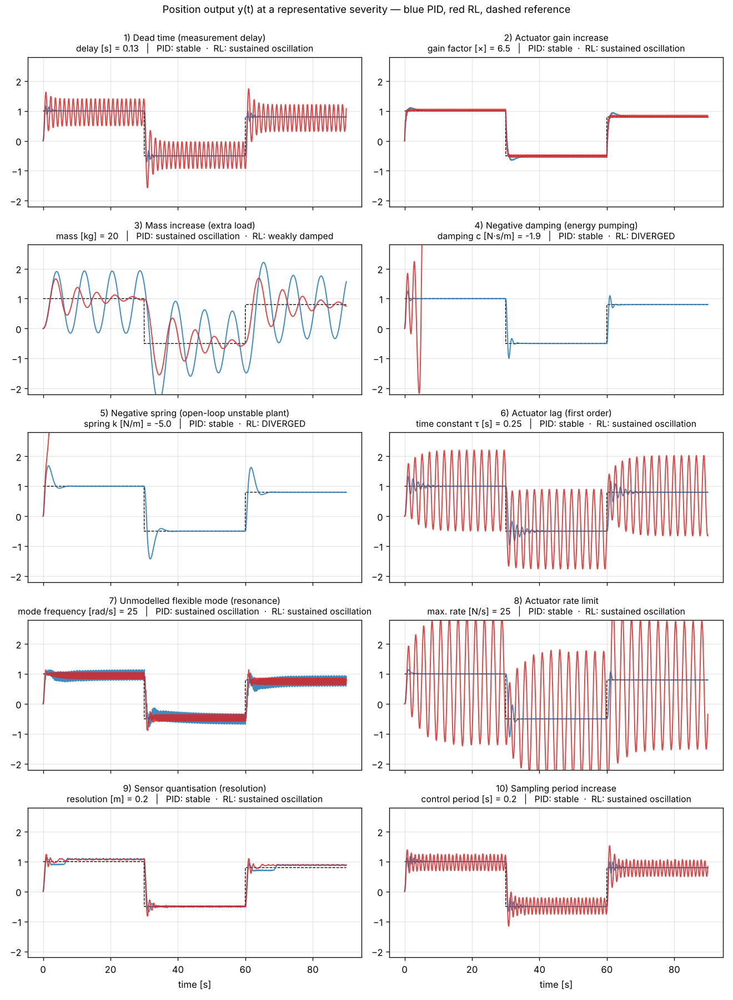

# PID or RL? A simple control experiment

This folder contains experiments that answer two questions:

1. Instead of a classical controller (PID), can an **empty neural network** be trained with **reinforcement learning (RL)** while looking only at the plant output?
2. How **robust to instability** is the trained network compared with PID? If instability appears, where does it start and how large is it?

Short answer: Yes, it can be trained, and under nominal conditions it gives lower error than PID (IAE 1.74 vs 2.31). However, in 8 of the 10 destabilising scenarios it breaks down **earlier** than PID.

All code uses only `numpy` and `matplotlib`. The PPO algorithm is written from scratch in numpy; no deep learning library is needed.

---

## Folder layout

```
pid_rl_control/
├── README.md              this file
├── requirements.txt
├── plant_pid.py           plant model, PID, simulation, test reference
├── rl_ppo.py              PPO training of the empty network -> data/results.pkl
├── plots.py               Figures 1-4 (PID, training, comparison)
├── robustness.py          10-scenario robustness sweep -> data/robust_results.pkl
├── plots_robust.py        Figures 5-6 (robustness)
├── extra_analysis.py      validation and interpretation numbers (RL equivalent gains, PID theoretical margins, saturation effect)
├── data/
│   ├── results.pkl            trained network weights + training logs
│   └── robust_results.pkl     robustness sweep results
└── figures/
    ├── 1_plant_and_pid.png
    ├── 2_training_curve.png
    ├── 3_output_during_training.png
    ├── 4_pid_vs_rl.png
    ├── 5_robustness_measurement.png
    └── 6_time_responses.png
```

## Running

```bash
pip install -r requirements.txt

# (optional) retrain the network from scratch — ~3 min on a single core. data/results.pkl is already provided.
python rl_ppo.py

python plots.py            # Figures 1-4
python robustness.py       # robustness sweep (~40 s)
python plots_robust.py     # Figures 5-6
python extra_analysis.py   # validation numbers
```

Run the scripts from this folder (`data/` and `figures/` are used via relative paths). The random seed is fixed (`seed=0`), so training is reproducible on the same machine.

---

## 1. Plant and PID

**Plant:** mass-spring-damper, `m·ẍ + c·ẋ + k·x = u`, measured output `y = x` (position).

| Parameter | Value |
|---|---|
| m, c, k | 1 kg, 0.4 N·s/m, 1 N/m (ωn = 1 rad/s, ζ = 0.2: clearly oscillatory in open loop) |
| Actuator limit | ±10 N |
| Control period | 0.05 s (20 Hz); the plant is integrated with RK4 at 0.01 s steps |
| Test reference | 1 m → −0.5 m → 0.8 m (10 s each) |

**PID:** Kp = 12, Ki = 6, Kd = 5. The derivative is taken on the measurement to avoid derivative kick on reference steps. The integrator is frozen while the actuator is saturated (anti-windup).

Result (Figure 1): ~8% overshoot, ~3.6 s settling time, zero steady-state error, IAE = 2.31.



## 2. Training an empty model with RL

**Model:** 3 → 64 → 64 → 1 MLP (tanh); the output layer is initialised near 0, so at the start the network does nothing (Figure 3, iteration 0).

**The "look only at the outputs" rule:**

- The network's inputs are only the reference `r`, the error `r − y` and the rate of change of the measured output `Δy/Δt`. All are derived from the plant output.
- The network **never sees** the `u` produced by the PID, so there is no imitation learning. It does not see the plant's internal states (velocity etc.) either.
- Reward: `−(e² + 0.1·|e|) − 0.2·(Δu/Umax)²`. The reward comes from the output error; the small Δu penalty is there to prevent chattering.

**Algorithm:** PPO (GAE λ = 0.95, γ = 0.98, clip = 0.2, Adam, linearly decaying learning rate). Each iteration runs 24 parallel episodes × 20 s with references made of random steps. 240 iterations in total, ~160 s on a single CPU core.

**Model selection:** Training is not monotonic. In late iterations the policy can oscillate continuously (Figure 3, iteration 240). The model was therefore selected on a fixed **validation** reference set separate from training (iteration 102). The test profile was not used for selection.





**Result (Figure 4):**

| Metric | PID | RL (iter 102) |
|---|---|---|
| IAE | 2.31 | **1.74** |
| Settling time | ~3.6 s | **~1.2 s** |
| Overshoot | **~8%** | ~11% |
| Control energy (∫u²) | **81** | 156 |
| Steady-state error | **~0** | ~0.5% (no integrator) |

PID-level performance was reached after ~20 iterations (~2.7 hours of simulated experience).



## 3. Robustness test: 10 destabilising scenarios

### Scenarios

Classic causes of instability from the control literature were chosen. Each is swept with a single "severity" parameter:

| # | Scenario | Physical meaning | Swept parameter |
|---|---|---|---|
| 1 | Dead time | measurement/communication delay | 0 – 1 s |
| 2 | Actuator gain | actuator stronger than expected | 1 – 60× |
| 3 | Mass increase | extra load | 1 – 60 kg |
| 4 | Negative damping | energy-pumping effect (flutter-like) | c: 0.4 → −15 |
| 5 | Negative spring | open-loop unstable plant (inverted-pendulum-like) | k: 1 → −14 |
| 6 | Actuator lag | slow actuator, first-order lag | τ: 0 – 3 s |
| 7 | Flexible mode | unmodelled structural resonance; sensor not co-located with the actuator | 60 → 0.5 rad/s |
| 8 | Actuator rate limit | limited rate at which the actuator can change force | 300 → 0.5 N/s |
| 9 | Sensor quantisation | sensor resolution | 0 – 0.6 m |
| 10 | Sampling period | the control loop slows down | 0.05 – 1 s |

### Measurement method

- For each severity value a 90 s simulation is run: 1 → −0.5 → 0.8 m, 30 s per step.
- The peak-to-peak oscillation in the last 10 seconds of each step is measured.
- Classification:
  - **Stable:** oscillation < 5 cm, or decaying ("weakly damped" is marked separately).
  - **Loss of stability:** ≥ 5 cm and not decaying (sustained oscillation / limit cycle).
  - **Divergence:** |y| > 5 m.
- The point where stability is lost is refined with the sweep + bisection.

**Validation of the method:** For the PID, discrete-time linear theory (ZOH, 20 Hz) was compared with simulation (`extra_analysis.py`):

| | Theory | Simulation |
|---|---|---|
| Delay margin | 0.169 s | 0.165 s |
| Gain margin | 7.18× | 7.16× |

### Results (Figures 5 and 6)

The values in the table are the points where stability is lost.

| Scenario | PID | RL | More robust |
|---|---|---|---|
| 1. Dead time | 0.165 s | 0.095 s | PID |
| 2. Actuator gain | 7.2× | 5.9× | PID |
| 3. Mass increase | 9.8 kg | 53.6 kg | **RL** |
| 4. Negative damping | c = −2.37 | c = −1.40 | PID |
| 5. Negative spring | k = −5.4 | k = −4.6 | PID |
| 6. Actuator lag | τ = 0.34 s | τ = 0.14 s | PID |
| 7. Flexible mode* | 28.9 rad/s | 28.4 rad/s | ≈ equal |
| 8. Rate limit* | 21 N/s | 29.5 N/s | PID |
| 9. Quantisation | 0.32 m | 0.14 m | PID |
| 10. Sampling | 0.235 s | 0.155 s | PID |

\* In these rows a lower value is more severe. For example, if the actuator is slower than 29.5 N/s the RL controller fails, while PID holds down to 21 N/s.





### Findings

**What did RL learn?** Linearising the network around the operating point gives these equivalent gains:

- Kp ≈ 28–31
- Kd ≈ 5
- About 1× feedforward from the reference
- No integrator

So RL discovered an **aggressive PD + feedforward** controller with roughly 2.5× the proportional gain of the PID (Kp = 12). This structure has two consequences:

- **Fragility to delay.** High gain gives a fast response but reduces the margin against delay. This explains the early failure in scenarios 1, 2, 6, 8 and 10.
- **Advantage under mass increase.** What destabilises the PID at heavy mass is the integral term (continuous-time Routh limit m < 11.7 kg). With RL, which has no integrator, oscillations only decay slowly as mass increases.

**Stability depends on signal amplitude.** Scenarios 4 and 5 were repeated with small 5 cm steps (without driving the actuator into saturation):

| | Large step (1 m) | Small step (5 cm) |
|---|---|---|
| Negative damping — PID | −2.37 | −4.18 |
| Negative damping — RL | −1.40 | −4.33 |
| Negative spring — PID | −5.37 | −10.84 |
| Negative spring — RL | −4.60 | no failure down to −14 |

With small signals RL is as robust as or more robust than PID in these two scenarios. With large signals both fail much earlier, and RL diverges on the first step. The cause is actuator saturation: once the force hits the ±10 N ceiling, the unstable plant cannot be pulled back. A stability test at a single amplitude can be misleading.

**Quantisation.** For both controllers a small "hunting" oscillation starts at any resolution. RL crosses the 5 cm threshold earlier.

---

## Limitations

- **Single network.** Only one trained network (one seed) was tested. A network trained with a different seed may give different limits.
- **Training conditions.** RL saw none of these disturbing conditions during training; it was trained only on the nominal plant.
- **Scenarios tested one at a time.** Real systems have several effects at once (e.g. delay + mass change).
- **No disturbances or noise.** Disturbance forces and sensor noise were not tested. Since RL has no integrator, a constant disturbance force will cause steady-state error.
- **Thresholds are a choice.** The 5 cm oscillation and 5 m divergence thresholds are a matter of choice. Absolute values depend on them, but the direction of the PID–RL comparison is not sensitive to them.
- **No guarantees.** There is no analytical stability guarantee for the neural-network controller. The results here are empirical, simulation-based measurements; they say nothing about behaviour in untested conditions.

## What could be done next?

**Making RL more robust**

1. **Domain randomisation.** Randomise delay, mass, actuator lag and sampling period during training. The most natural next step: check whether the margins improve on the same 10 scenarios.
2. **Adding integral action.** Add the integral of the error to the observation, or use a recurrent (LSTM/GRU) policy. This improves steady-state error and disturbance rejection.
3. **Limiting the gain.** Add a high-frequency control penalty to the reward or constrain the network's Lipschitz constant, forcing it to learn a lower-gain controller with wider margins.
4. **Residual RL.** Keep the PID in place and let RL learn only a small correction term. Part of the speed advantage is kept while the PID's robustness remains the baseline.
5. **Safety layer.** A filter (safety filter / shield) that constrains the RL output so it cannot leave the stability region.

**Extending the measurements**

6. **Multi-seed statistics.** Train with 5–10 different seeds and report the distribution of the limits.
7. **Combined scenarios.** Sweep two effects at once (e.g. delay × mass) and produce a 2D stability map.
8. **Disturbance and noise tests.** Add constant/impulse disturbance forces and sensor noise.
9. **Amplitude sweep.** Vary the reference amplitude systematically and map how the stability region depends on amplitude.
10. **Other RL algorithms.** Compare with algorithms such as SAC/TD3 (e.g. stable-baselines3).

**Harder problems**

11. **Nonlinear plant.** Repeat the experiment with a nonlinear, open-loop unstable plant such as an inverted pendulum.
12. **Multi-input multi-output (MIMO) systems.** RL's advantage may grow where classical tuning becomes difficult.

**Verification and deployment**

13. **Formal verification.** Use neural-network verification methods (e.g. reachability analysis) to try to prove stability over a given parameter range.
14. **Porting to an embedded target.** Run the network in fixed-point arithmetic, measure its execution time and study how the loss of precision affects control performance.
